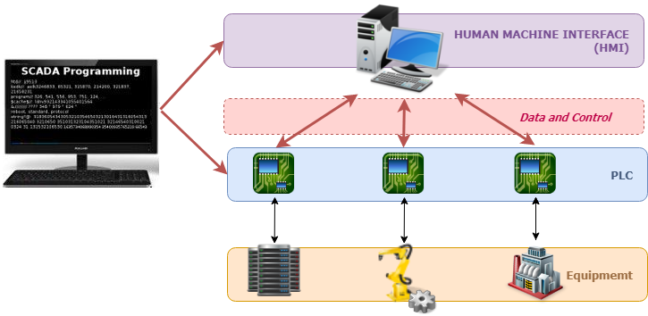

## Your Task

The objective of this assignment is to _elaborate_ and _communicate_ a threat model of a realistic system, in particular a production line robot.
Production line, or assembly, robots are perfect for tasks requiring speed, accuracy and rigorous standards of cleanliness.
However, their usage might _increase_ the attack surface of an automated production line in non-obvious ways.
Your task is to document this effect using a visual tool for designing attack trees representing a threat model.

### Background

Using the techniques and concepts you have learned in class, document the threat model for a production line robot. You can assume that the production line is automated and the robots communicate exclusively through wireless communication. There are two ways to configure/control a robot:
 * An employee uses a Desktop computer (called a _coordinating computer_) to push a robot-specific configuration file containing the activities to be performed throughout the next period of 6 hours. The commands in the file are then sent through the wireless network to Programmable Logic Controllers (PLCs) directly connected to the robots that translate them as low-level commands.
 * Connecting to the PLC directly through a smartphone using Bluetooth technology. This can only be performed by employees who successfully authenticate using their correct password in the corporate mobile application.

It is also possible to update a robot's firmware through the wireless network by pushing an update.
The multiple coordinating computers are interconnected through a wired network. An employee can use a coordinating computer to send files or push updates after successfully authenticating with a password. You can use the diagram below as reference (the red layer is the wireless communication network):

### Material

You should use the [Deciduous tool](https://www.deciduous.app/) to document the threat model. Documentation about how to use the tool can be found in [a blog post](https://swagitda.com/blog/posts/deciduous-attack-tree-app/).
The tool itself has a very detailed example about accessing Amazon S3 buckets. For reference, the attack tree for the _smart_ safe example we saw in class can be found in the repository.

You are free to enrich this system description with additional assumptions if you want to make the scenario more challenging or tailored to your interests.

### Logistics

For the hand-in, write a brief single-page report containing a description of your threat model, and include the attack tree produced by the tool.
You can split the tree in two in case it grows too much. You can find the submission link on Brightspace.
